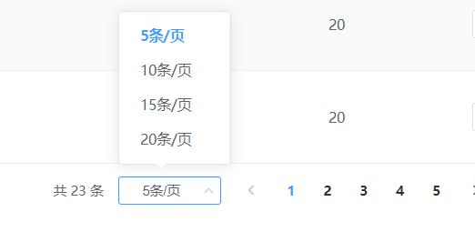
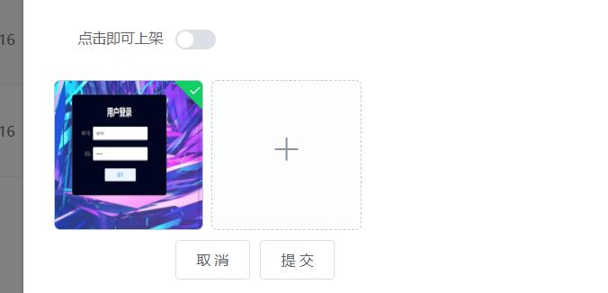

# myprojct

## Project setup
```
npm install
```

### Compiles and hot-reloads for development
```
npm run serve
```

### Compiles and minifies for production
```
npm run build
```

### Run your tests
```
npm run test
```

### Lints and fixes files
```
npm run lint
```

### Customize configuration
See [Configuration Reference](https://cli.vuejs.org/config/).

###  在线说明文档
### 基于mongodb+nodejs+exrpress+element+vue.js
```
一 mongodb使用
1）命令函： 
（mongo：代表进入mongo环境）  (show dbs ：显示数据库) （db当前）
    （use goods ：切换到goods）
2）Token令牌 ：
就是一个加密的字符串 加密算法在。 权限管理
当第一次登陆以后生成一个令牌  （这个令牌是加密的） 设置有效期
用户第一次使用用户名登陆成功后，后端生成病返回给前端保存
令牌是有有限期的 亦可以伪造 所以要校验  nodejs 有加密和解-解密
步骤一：项目准备工作
1  vue create myprojct 创建项目 （myprojct 项目名字）
2  淘宝镜像源npm install -g cnpm(使用下载更快)
1）myproject安装  项目所需的各种依赖 
1   npm install vue-resource --save -dev
2   npm install axios --save	
3   npm install element-ui -S
4   npm install vuex --save
5   npm install animate.css --save
6   npm install -g babel
7   npm i core-js
2）mongodb安装  上传头像 mongo 先下载Npm i mullter  
1mongodb文件夹：在mongodb index文件的作用引用  注意点当每次编写接口都需要在index.js
引入路由文件	以及router.use(文件路径，文件名)
3）引入公共css在public        （reset文件夹名字）第二要使用在public里面的index.html 引入css
 <link rel="stylesheet" href="css/reset.css">
  <link href="//cdn.bootcss.com/font-awesome/4.7.0/css/font-awesome.css" rel="stylesheet"> 这一个是引入boootcss这个css
4)router.js 路由 1 定义（路由）组件  
             2 定义路由  
             3 创建 router 实例，
             4 然后传 `routes` 配置  创建和挂载根实例。导出路由然后在min.js引入
在这个项目里面使用了嵌套路由注意和	LeftMenu.vue 关系  children 里面是路由嵌套
leftmenu后面细说
5）配置min.js 
```		

store在后台管理系统里面是没有使用的	
```
6）图片assets
7）在views创建 Register.vue Login.vue 404.vue项目 index.vue
```
### 步骤二：项目
```
1 注册页面    接口是user.js 登录页面 有有联系页面是myproject 的 http.js 和login.vue
Authorization就是token当code===1时候	let targetUrl = this.$route.query.targetUrl || './Index'			
代码解释：声明一个目标路由如果有目标地址就跳转到目标地址
没有就跳转到首页面Index.vue 保存token
  2创建htttp.js 引入	loading和引入axios	使用loading和请求拦截和相应拦截环节和使用loading
当	请求数据code==1 就跳转到index.vue token校验
跳转到index.vue  后components里面再创建leftMenu.vue  和HeadNav.vue 具体看leftMenu以里面的嵌套路由  这两个文件夹引入到views的 Index.vue里面	 使用import .. from ..引入切注册组件
HeadNav.vue ：取出token校验 解码（没写此步骤）当点击退出删除token
leftMenu.vue 里面有嵌套路由 足以逻辑的使用 children增加子路由步骤
1在 leftMenu.vue 下面cheildren 的  ·{ path: "FoundEdit", name: "编辑商品" },
2找到router.js import   import FoundAdd from './views/FoundAdd'
3http.js里面loading的使用 结合请求拦截和相应拦截做loading （效果当更改路由页面时loading）
```
### 步骤三：数据交互 
是为了下个功能模糊查询的实现：
实现渲染的关键是prop
```
模块开发：先创建几个路由
比如foundlis写好样式	async reder（）{
let {data}= awit this.$axios.get("http://localhost:1906/goodsAdmin")
this.tableData= data   （tableData不是随便写的容器）
```


```
~~~~~~~~模糊查询的实现~~~~~~~~~
Element-ui表格，table自定义表头Data Table表格 
根据根据filter属性数据过滤的选项，数组格式，数组中的元素需要有 
text和value属性
实现这个能仅仅两步骤
1请求到数据渲染到页面
22 查询功能的关键 element这里写的是 name 把这个name换成title ，title是自己数据库的名字
~~~~~~~~模糊查询的实现~~~~~~~~~
```

```
~~~~~~~~分页功能的实现~~~~~~~
说明：前端的分页未使用分页接口
在</el-table>下面写下面代码也就是不要在同一个容器内使用相当于html  下面分页步骤已经截图
<el-row>
   <el-col :span="24">
     <div class="pagination">
        <el-pagination v-if='paginations.total > 0' @size-       change="handleSizeChange"
          @current-change="handleCurrentChange"     :current-page="paginations.page_index"
          :page-sizes="paginations.page_sizes" :page-           size="paginations.page_size"
          layout="total, sizes, prev, pager, next, jumper" :total=  "paginations.total" >
           </el-pagination>
              </div>
            </el-col>
    </el-row>
~~~~~~~~分页功能的实现~~~~~~~
步骤截图
```


### 文字说明
```
   （1） this.tableData = data 这个是此前本来的容器存放数据用的 注释 掉 这句代码
   （2）this.alltTableDate = date    现在把所有数据存到另外的容器里面    allTableDate
   （3）设置分页数据  this.setpaginatios()
    (4)this.setpaginatios(){
    Dialog
  在fondlist引入实现效果是点击显示dialog页面  	
  <Dialog :dialog='dialog'></Dialog>
  import Dialog from "../components/Dialog";

```
### 注意点
```
注意点：element-ui验证规则，需要表单标签el-form上加上:rules="rules"，然后与表单内输入框input上绑定prop对应的验证
注意点query编程是路由传参 
例如点击编辑页面使用  handEdit（index，row）{
this.router.push({
path:"../FoundEdit" ,query:{id:row_id} })
}
目标页面接受参数：
```

### 页面展示





```
短信验证码
首先下载
npm body-parser request querystring （request querystring是聚合数据短信验证码的部分模块安装）配置好node环境 复制聚合node数据里面代码 改mobiel 和id key 等值
res.json(jsonObj);//这样postman就可以使用看到了  返回给前端 查看server.js

必须是nodeJs+express环境 具体参考server.js
// 短信部分~·······················  （api  postman测试） http://localhost:1906/sms_send 手机号可以改变
 //  [{"key":"phone","value":"18827501308",}] ,[{"key":"tpl_id","value":"172633","description":""}],[{"key":"key","value":"4e874ecc96c1b783c9886c4f0db5d4bf",}]
const bodyParser = require('body-parser') //短信
const request = require('request')//短信
const querystring = require('querystring')//短信
// parse application/x-www-form-urlencoded
app.use(bodyParser.urlencoded({ extended: false }))
// parse application/json
app.use(bodyParser.json())   
app.post("/sms_send",(req,res)=>{
    //  console.log(req.body.phone);  
     //node request模块安装命令：npm install request
   let code = ("000000" +Math.floor(Math.random()*999999)).slice(-6);//表示取六位数据
var queryData = querystring.stringify({
    mobile: req.body.phone,  // 接受短信的用户手机号码
    tpl_id: req.body.tpl_id,  // 您申请的短信模板ID，根据实际情况修改
    tpl_value: `#code#=${code}`,  // 您设置的模板变量，根据实际情况修改 
    key:req.body.key,  // 应用APPKEY(应用详细页查询)
});

var queryUrl = 'http://v.juhe.cn/sms/send?'+queryData;

request(queryUrl, function (error, response, body) {
	if (!error && response.statusCode == 200) {
		// console.log(body) // 打印接口返回内容
		
		var jsonObj = JSON.parse(body); // 解析接口返回的JSON内容
        // console.log(jsonObj)    
        res.json(jsonObj);//这样postman就可以使用看到了
	} else {
		console.log('请求异常');
	}
}) 
})
 
// //解决跨域
// app.all('*',function (req, res, next) {
//   res.header('Access-Control-Allow-Origin', '*');
//   res.header('Access-Control-Allow-Headers', 'Content-Type, Content-Length, Authorization, Accept, X-Requested-With');
//   res.header('Access-Control-Allow-Methods', 'PUT, POST, GET, DELETE, OPTIONS');
//   if (req.method == 'OPTIONS') {
//     res.send(200);
//   }
//   else {
//     next();
//   }
// });
// 利用中间bodyParse格式化请求参数  跨域解决
// Router.use(express.json(),express.urlencoded({extended:false}))

router.use((req,res,next)=>{
    res.header("Access-Control-Allow-Origin", "*");
    res.header("Access-Control-Allow-Headers", "Content-Type,Content-Length, Authorization, Accept,X-Requested-With");
    res.header("Access-Control-Allow-Methods","PUT,POST,GET,DELETE,PATCH,OPTIONS");
    if(req.method=="OPTIONS") {// 在预请求中告诉浏览器这里允许跨域，让她发真实的请求过来吧
        res.sendStatus(200);
        // 等效于：res.status(200).send()
    }else{
        next();
    }
})
// 短信部分~~························